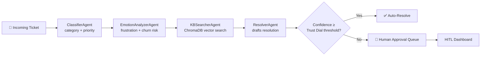

<a name="readme-top"></a>

<div align="center">


# HelpPilot

### The IT Helpdesk That Runs Itself — Safely

*A multi-agent autopilot that classifies, understands, searches, and resolves IT tickets — with a human always one click away from the wheel.*

<br/>

[](./LICENSE)
[](https://www.qwencloud.com/)
[](https://www.alibabacloud.com/)
[](https://www.docker.com/)
[](https://www.typescriptlang.org/)
[](https://react.dev/)

**[🌐 Live Demo](https://helppilot.run.place)** &nbsp;·&nbsp; **[📹 Demo Video](#)** &nbsp;·&nbsp; **[🐛 Report Bug](https://github.com/ErkinovAsliddin/HelpPilot/issues)** &nbsp;·&nbsp; **[✨ Request Feature](https://github.com/ErkinovAsliddin/HelpPilot/issues)**

<sub>Built solo for the **Qwen Cloud Global AI Hackathon** — Track 4: Autopilot Agent 🏆</sub>

</div>

<br/>

---

## 📋 Table of Contents

- [The Problem](#-the-problem)
- [The Solution](#-the-solution)
- [Features](#-features)
- [How It Works](#-how-it-works)
- [Tech Stack](#-tech-stack)
- [Alibaba Cloud Deployment](#️-alibaba-cloud--qwen-cloud-deployment)
- [Getting Started](#-getting-started)
- [Environment Variables](#-environment-variables)
- [Demo Walkthrough](#-demo-walkthrough)
- [Roadmap](#-roadmap)
- [License](#-license)
- [Acknowledgments](#-acknowledgments)

<p align="right">(<a href="#readme-top">back to top</a>)</p>

---

## 😤 The Problem

Every IT helpdesk drowns in the same flood: forgotten passwords, VPN timeouts, printer offline reports — buried in the *same queue* as a critical AD replication failure or a swollen laptop battery that's a genuine safety hazard. Human agents burn hours triaging noise instead of solving problems, and by the time someone notices five people reported the same VPN error, it's already an incident.

## 💡 The Solution

**HelpPilot** reads every ticket the moment it lands — classifies it, reads the *emotion* behind it, searches a live knowledge base, and drafts (or autonomously executes) a resolution. It correlates related tickets into incidents before they snowball, and it lets admins dial in *exactly* how much autonomy the system earns, one category at a time. Nothing happens in a black box — every decision leaves a full, inspectable reasoning trail.

<p align="right">(<a href="#readme-top">back to top</a>)</p>

---

## ✨ Features

<table>
<tr>
<td width="50%" valign="top">

### 🧠 Multi-Agent Reasoning Pipeline
Four specialized agents — `ClassifierAgent`, `EmotionAnalyzerAgent`, `KBSearcherAgent`, `ResolverAgent` — each hand off a structured output, and each step is logged with inputs, outputs, and timing for full transparency.

### 🎚️ Trust Dial
Set **independent autonomy thresholds per ticket category**. Auto-resolve password resets instantly. Always escalate hardware failures. Your rules, per category, no all-or-nothing switch.

### 🔁 Verified Auto-Remediation Loop
HelpPilot scores its own confidence before acting. Low-confidence drafts route to a human automatically — it never guesses its way into production.

</td>
<td width="50%" valign="top">

### 🚨 Predictive Incident Detection
A background `PredictionEngine` correlates ticket patterns in real time — five VPN failures in ten minutes becomes **one incident**, not five duplicate tickets.

### 🎙️ Voice Command Control
A fully voice-driven admin mode. Native browser speech recognition + Qwen Cloud NLU for free-form commands: *"How many tickets are pending?"* — HelpPilot answers, out loud.

### 👀 Human-in-the-Loop Dashboard
Every autonomous action is inspectable and reversible before it ships — see exactly what each agent saw and decided.

</td>
</tr>
</table>

<p align="right">(<a href="#readme-top">back to top</a>)</p>

---

## ⚙️ How It Works



Meanwhile, a parallel `PredictionEngine` watches ticket velocity per error signature — spotting incidents before they flood the queue.

<p align="right">(<a href="#readme-top">back to top</a>)</p>

---

## 🛠️ Tech Stack

| Layer | Technology |
|:--|:--|
| 🤖 LLM Inference | **Qwen Cloud** (`qwen-plus`) via OpenAI-compatible API |
| 🖥️ Backend | Node.js · Express · TypeScript |
| 🗃️ Ticket State | SQLite |
| 🔎 Knowledge Base | ChromaDB (vector search) |
| 🎨 Frontend | React · TypeScript · real-time dashboard |
| 🎙️ Voice | Web Speech API + Qwen Cloud NLU fallback |
| 📦 Deployment | Docker container on **Alibaba Cloud ECS** |
| 🔒 Reverse Proxy / SSL | Nginx + Let's Encrypt |

<p align="right">(<a href="#readme-top">back to top</a>)</p>

---

## ☁️ Alibaba Cloud + Qwen Cloud Deployment

HelpPilot's backend is fully containerized and running live on **Alibaba Cloud ECS**, calling **Qwen Cloud's** OpenAI-compatible API for every LLM inference call:

```
API Base URL: https://dashscope-intl.aliyuncs.com/compatible-mode/v1
Model: qwen-plus
```

**Proof of integration:**
- [`src/utils/bedrockClient.ts`](./src/utils/bedrockClient.ts) — Qwen Cloud chat completions + embeddings client
- [`Dockerfile`](./Dockerfile) — production container build
- Live at **[helppilot.run.place](https://helppilot.run.place)**, served from Alibaba Cloud ECS via Nginx + Let's Encrypt SSL

<p align="right">(<a href="#readme-top">back to top</a>)</p>

---

## 🚀 Getting Started

### Prerequisites

- Node.js 20+
- Docker
- A free [Qwen Cloud](https://www.qwencloud.com/) API key

### Installation

```bash
# 1. Clone the repo
git clone https://github.com/ErkinovAsliddin/HelpPilot.git
cd HelpPilot

# 2. Configure environment
cp .env.example .env
# → add your QWEN_API_KEY to .env

# 3. Build & run
docker build -t helppilot-app .
docker run -d --name helppilot-app-1 -p 3000:3000 --env-file .env helppilot-app
```

Open **`http://localhost:3000`** — you're live. 🎉

<p align="right">(<a href="#readme-top">back to top</a>)</p>

---

## 🔧 Environment Variables

| Variable | Required | Description |
|:--|:--:|:--|
| `QWEN_API_KEY` | ✅ | Your Qwen Cloud API key |
| `QWEN_MODEL` | – | Model name (default: `qwen-plus`) |
| `MOCK_MODE` | – | Set `true` to run fully offline with deterministic mock responses |

<p align="right">(<a href="#readme-top">back to top</a>)</p>

---

## 🎬 Demo Walkthrough

1. **Submit a ticket** — plain text, pasted email thread, or an image attachment
2. Watch the **reasoning trace** populate live, agent by agent
3. See the **Trust Dial** decide: auto-resolve, or escalate to a human
4. Approve or override from the **HITL dashboard**
5. Try a **voice command**: *"How many pending tickets?"* or *"Approve the first ticket"*

<p align="right">(<a href="#readme-top">back to top</a>)</p>

---

## 🗺️ Roadmap

- [ ] Multi-language ticket support beyond English/Spanish
- [ ] Slack / Teams integration for ticket submission
- [ ] Configurable SLA-based escalation timers
- [ ] Public API for third-party ticket sources

See [open issues](https://github.com/ErkinovAsliddin/HelpPilot/issues) for the full list of proposed features.

<p align="right">(<a href="#readme-top">back to top</a>)</p>

---

## 📄 License

Distributed under the **MIT License**. See [`LICENSE`](./LICENSE) for details.

<p align="right">(<a href="#readme-top">back to top</a>)</p>

---

## 🙏 Acknowledgments

- [Qwen Cloud](https://www.qwencloud.com/) & [Alibaba Cloud](https://www.alibabacloud.com/) for the hackathon infrastructure and credits
- [ChromaDB](https://www.trychroma.com/) for vector search
- [Best-README-Template](https://github.com/othneildrew/Best-README-Template) for structural inspiration

<p align="right">(<a href="#readme-top">back to top</a>)</p>

---

<div align="center">

**Built with ⚡ by [Erkinov Asliddin](https://github.com/ErkinovAsliddin)**

</div>
